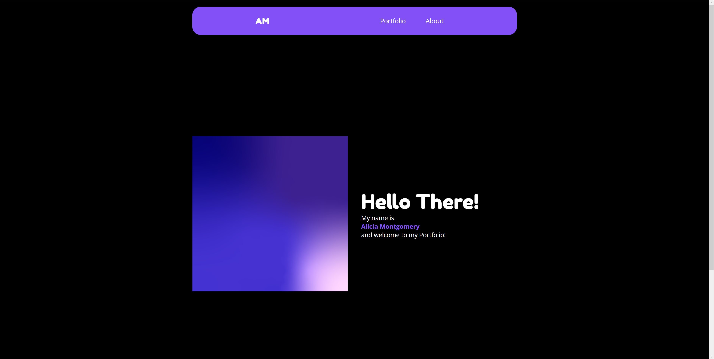
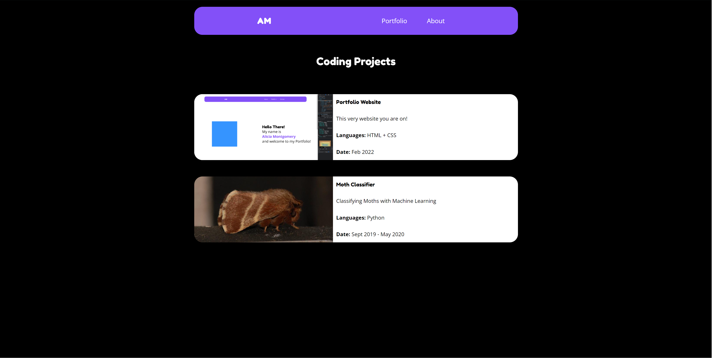
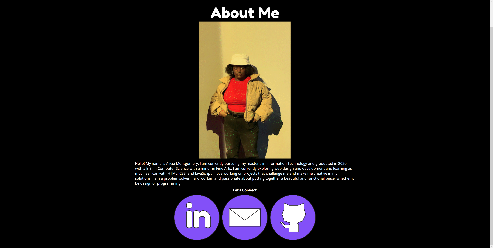

# PortfolioWebsite

This is my Portfolio Website! (Work in progress). It is where I am putting to practice the coding skills I have learned in school or taught myself. 

### Progress
[4/13/2022] I finsihed the first draft of the project. I created the website in Figma initally (Which you can see here: [Figma File](https://www.figma.com/file/CSWbiWfHn9qr3yY5qCLrUR/Portfolio-Moodboard?node-id=0%3A1))

- Accomplishments

   I taught myself HTML and CSS in a multipage format. 
- Next Steps
  
  **Learn Javascript.** I would like to add some cool functionality, such as animations. I want to also learn it so I can start learning React.js.
  
  **Learn image optimization.** When I originally hosted the website, it was taking a long time to load the images I had. I want to learn how to optimize them so I can increase web responsiveness.
  
  **API Usage.** I want to learn about API usage. I have used it for other projects before but not for web. 
